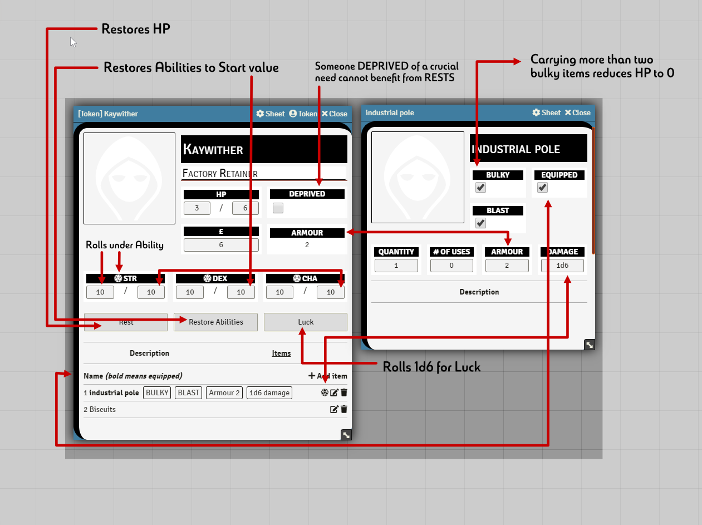

# The Electric Bastionland system for FoundryVTT!

Implements basic character and item sheets for playing [Electric Bastionland](https://bastionlandpress.com/products/electric-bastionland-hardback-book) in Foundt VTT.

Character creation, spark tables and such are *not* implemented. You still need the book / pdf.

The code is based on the [Into The Odd system](https://github.com/voidcase/IntoTheOdd-FoundryVTT/blob/master/README.md) for FoundryVTT
